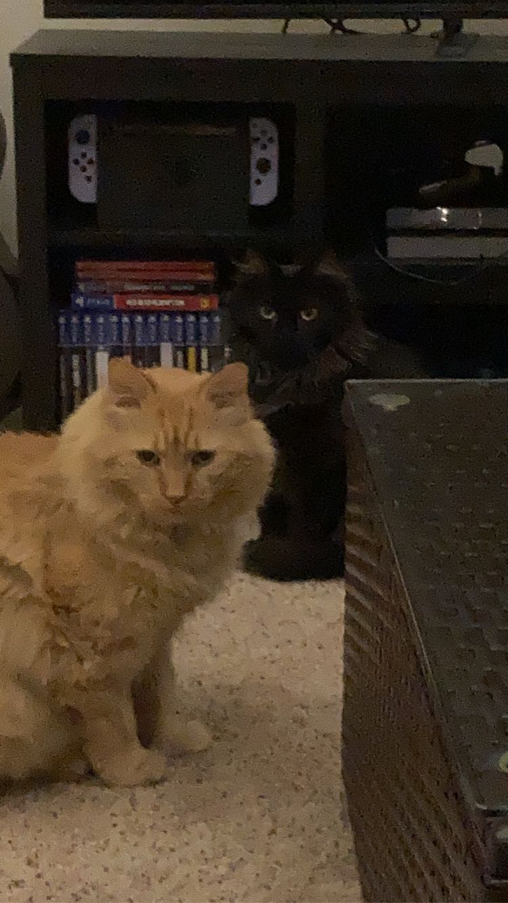

```{r setup, include=FALSE}
knitr::opts_chunk$set(echo = FALSE)
```

## Introduction

My name is Ryan Lalicker. I am expecting to graduate from the statistics department in May 2025. I am originally from Goodland, KS and went to undergrad in Hays, KS.

## Favorite animals - my cats Garfield and Mika

{width="330"}

## Slide with Plot

```{r pressure}
library(ggplot2)

penguinsR <- readr::read_csv('penguins.csv', show_col_types = FALSE)

ggplot(data = penguinsR, aes(x = year, y = bill_length_mm, color = species)) + geom_line() + scale_color_manual(values = c("Adelie" = "red", "Chinstrap" = "maroon", "Gentoo" = "yellow")) + theme(panel.background = element_rect("darkgreen")) + labs(title = "Penguine bill length by year", x = "Year", y = "Length of bill (mm)")

```

## CV Link.

<https://github.com/RyanLalicker/RyanLalicker.github.io/blob/14111b33cfb883da8ba9a2036364c838d95f5767/LaTeXTemplates_moderncv-cv-and-cover-letter_v1.3/MockCV.pdf>
